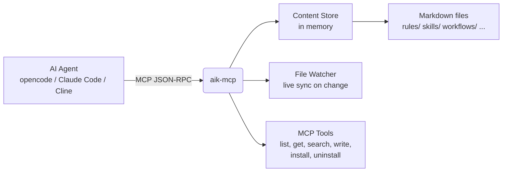

<div align="center">
  <h1 align="center">aik-mcp</h1>
</div>
<div align="center">
  <em>AI Knowledge — MCP Server</em>
</div>

<p align="center">
Give your AI agents a memory.<br>
Rules, skills, workflows, and templates — as plain Markdown, served over the Model Context Protocol.
</p>

<p align="center">
  <a href="https://www.npmjs.com/package/@headwood/aik-mcp"></a>
  <a href="https://openhoat.github.io/aik-mcp/"></a>
  <a href="https://github.com/openhoat/aik-mcp/actions/workflows/ci.yml"></a>
  <a href="https://github.com/openhoat/aik-mcp/blob/main/LICENSE"></a>
  <a href="https://nodejs.org/"></a>
  <a href="https://codecov.io/gh/openhoat/aik-mcp"></a>
</p>

---

**aik-mcp** turns a directory of Markdown files into a live, queryable knowledge base for any [MCP](https://modelcontextprotocol.io)-compatible AI agent — [opencode](https://opencode.ai), [Claude Code](https://docs.anthropic.com/en/docs/claude-code), [Cline](https://cline.bot), and more.

Write your team's conventions, reusable workflows, agent prompts, and project templates as plain `.md` files with YAML frontmatter. **aik-mcp** serves them on demand — your agent can discover, read, search, and install them at runtime, across any project.

No database. No API to build. Just Markdown.

## Features

| Icon | Feature                   | Why it matters                                                                                 |
|------|---------------------------|------------------------------------------------------------------------------------------------|
| 📝   | **Knowledge as Markdown** | Plain `.md` files with frontmatter. Version them with git. Review them in PRs.                 |
| ⚡    | **Zero config**           | `npx aik-mcp` runs immediately. Point it at a folder of Markdown files. Done.                  |
| 🔎   | **Full-text search**      | Fuzzy search across every rule, skill, and template — powered by [Fuse.js](https://fusejs.io). |
| 📦   | **Install on demand**     | Push knowledge directly into your agent's runtime config with a single tool call.              |
| 👀   | **Live sync**             | A file watcher detects changes instantly. No restart. No downtime.                             |
| 🔌   | **Universal MCP**         | Works with opencode, Claude Code, Cline, and any MCP-compatible client.                        |

## Quick start

### 1. Create a rule

```bash
mkdir -p my-knowledge/rules
cat > my-knowledge/rules/typescript.md << 'EOF'
---
title: TypeScript Conventions
description: Coding standards for TypeScript projects
tags: [typescript, conventions]
version: "1.0.0"
compatibility: [opencode, claude-code, cline]
---

## TypeScript Conventions

- Use explicit types for public API surfaces
- Prefer `interface` over `type` for object shapes
- Use `const` assertions for literal values
EOF
```

### 2. Start the server

```bash
AIK_CONTENT_DIR=./my-knowledge npx aik-mcp
```

### 3. Ask your agent

```text
"Find and apply the TypeScript conventions rule for this project."
```

Your agent calls `aik_search`, reads the rule, and applies it — all transparently through MCP.

## Docs

Full documentation is available at **[openhoat.github.io/aik-mcp](https://openhoat.github.io/aik-mcp/)**.

## How it works



Your agent speaks MCP on one side. **aik-mcp** speaks your file system on the other. Everything is cached in memory for fast lookups, and a file watcher keeps the cache up to date.

## Client configuration

### opencode

Add to `opencode.jsonc` or `.opencode/opencode.jsonc` in your project:

```jsonc
{
  "$schema": "https://opencode.ai/config.json",
  "mcp": {
    "aik": {
      "type": "local",
      "command": ["npx", "-y", "aik-mcp"],
      "enabled": true,
      "environment": {
        "AIK_CONTENT_DIR": "/path/to/your/knowledge",
        "LOG_LEVEL": "info"
      }
    }
  }
}
```

### Claude Code

Add to `.mcp.json` or `~/.claude/settings.json`:

```json
{
  "mcpServers": {
    "aik": {
      "command": "npx",
      "args": ["aik-mcp"],
      "env": {
        "AIK_CONTENT_DIR": "/path/to/your/knowledge",
        "LOG_LEVEL": "info"
      }
    }
  }
}
```

### Cline

Add to `cline.json` or project `.mcp.json`:

```json
{
  "mcpServers": {
    "aik": {
      "command": "npx",
      "args": ["aik-mcp"],
      "env": {
        "AIK_CONTENT_DIR": "/path/to/your/knowledge",
        "LOG_LEVEL": "info"
      }
    }
  }
}
```

> **Tip:** Set `AIK_CONTENT_DIR` to a shared path (Dropbox, git repo, team NAS, etc.) to use the same knowledge base across projects and agents.

## Content structure

Content items are organized by category:

| Directory    | Purpose                                        |
|--------------|------------------------------------------------|
| `rules/`     | Coding standards, conventions, quality gates   |
| `skills/`    | Reusable instruction blocks (prompts, recipes) |
| `workflows/` | Multi-step process definitions                 |
| `agents/`    | Specialized agent configurations               |
| `commands/`  | Custom CLI command definitions                 |
| `templates/` | File and project scaffolding                   |

Each file is a Markdown document with YAML frontmatter:

```markdown
---
title: "My Rule"
description: "What this rule enforces"
tags: [tag1, tag2]
version: "1.0.0"
compatibility: [opencode, claude-code, cline]
---

## My Rule

Content here...
```

## MCP tools

| Tool                 | Description                                                |
|----------------------|------------------------------------------------------------|
| `aik_list`           | List content items, optionally filtered by category or tag |
| `aik_get`            | Retrieve a specific item by path (e.g. `rules/typescript`) |
| `aik_search`         | Full-text fuzzy search across all content                  |
| `aik_write`          | Create or update a content item from the agent             |
| `aik_delete`         | Delete a content item                                      |
| `aik_install`        | Install an item into the project's agent config            |
| `aik_reinstall`      | Reinstall the latest version of an installed item          |
| `aik_uninstall`      | Remove an installed item from the project                  |
| `aik_uninstall_all`  | Remove all aik-installed items from the project            |
| `aik_list_installed` | List items currently installed in the project              |

## Resources

| URI                  | Description                                       |
|----------------------|---------------------------------------------------|
| `aik://{category}`   | List all items in a category (e.g. `aik://rules`) |
| `aik://search?q=...` | Search items by keyword                           |

## CLI options

| Flag         | Default | Description                             |
|--------------|---------|-----------------------------------------|
| `--http`     | —       | Start in HTTP/SSE mode instead of stdio |
| `--port <n>` | `3456`  | HTTP server port (only with `--http`)   |
| `--no-watch` | —       | Disable file watching                   |

## Environment variables

| Variable          | Default | Description                                                    |
|-------------------|---------|----------------------------------------------------------------|
| `AIK_CONTENT_DIR` | `.`     | Path to the content directory                                  |
| `LOG_LEVEL`       | `info`  | Log level: `trace`, `debug`, `info`, `warn`, `error`, `silent` |

## Development

```bash
npm install
npm run build
npm run test
npm run qa
```

### Scripts

| Script              | Description                                  |
|---------------------|----------------------------------------------|
| `npm run build`     | Compile TypeScript to `build/`               |
| `npm test`          | Run Vitest test suite                        |
| `npm run qa`        | Lint + format check (Biome + markdownlint)   |
| `npm run qa:fix`    | Auto-fix lint and formatting issues          |
| `npm run typecheck` | TypeScript type checking (`tsc --noEmit`)    |
| `npm run validate`  | Full pipeline: qa → typecheck → build → test |

## Contributing

Contributions are welcome! Open an [issue](https://github.com/openhoat/aik-mcp/issues) or submit a PR.

See the [changelog](https://github.com/openhoat/aik-mcp/releases) for release history.

Full documentation at **[openhoat.github.io/aik-mcp](https://openhoat.github.io/aik-mcp/)**.

## License

MIT
