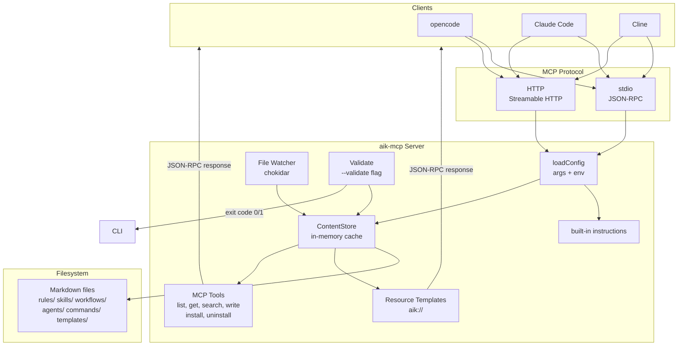
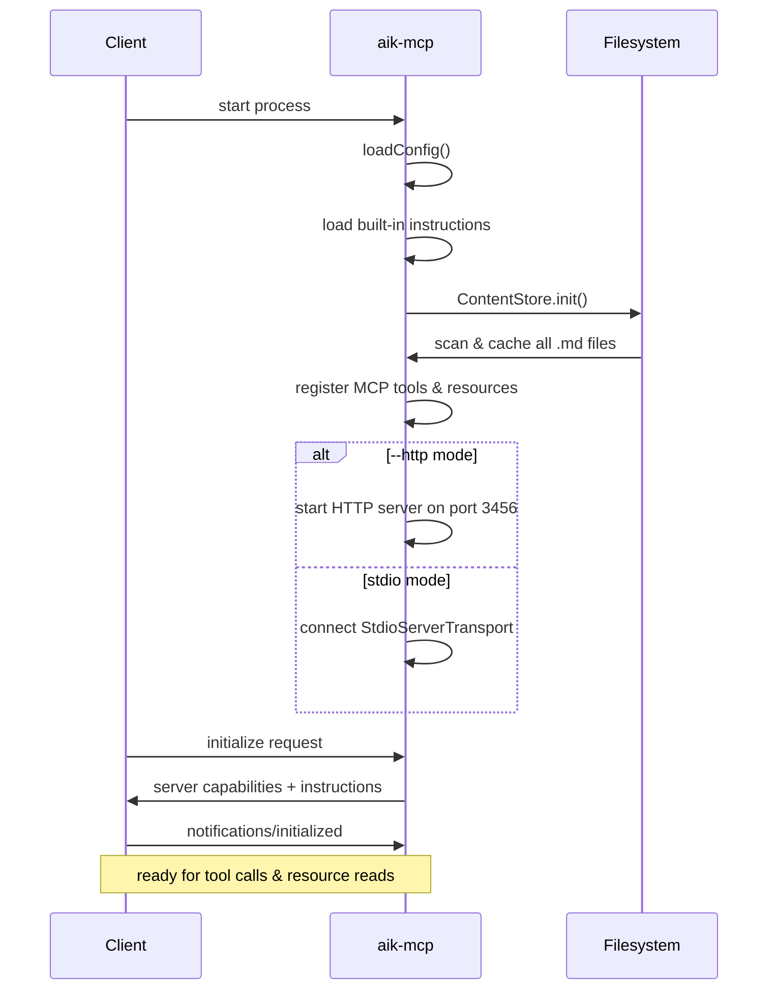
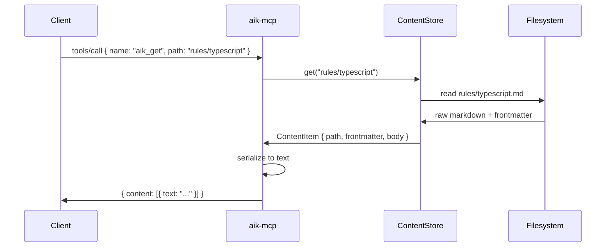
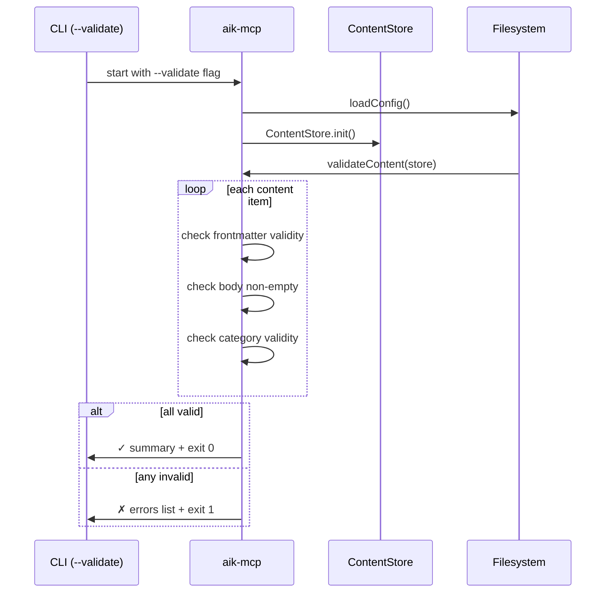

# Architecture

## Overview

## Startup sequence

## Tool call flow

## Validate flow

## Components

| Component     | File                      | Responsibility                                                                   |
|---------------|---------------------------|----------------------------------------------------------------------------------|
| Entry point   | `src/index.ts`            | CLI bootstrap, flag parsing, server start                                        |
| Config        | `src/config.ts`           | Parse CLI flags + env vars into `AikConfig`                                      |
| Logger        | `src/logger.ts`           | Pino structured JSON logger                                                      |
| Content Store | `src/content-store.ts`    | Scan, cache, watch, and query `.md` files                                        |
| Search        | `src/search.ts`           | Full-text fuzzy search across cached items                                       |
| Frontmatter   | `src/frontmatter.ts`      | Parse/serialize YAML frontmatter with Zod validation                             |
| Validate      | `src/validate.ts`         | Validate all content items for consistency                                       |
| Tools         | `src/tools/*.ts`          | MCP tool handlers (list, get, search, write, delete, install, uninstall, update) |
| Resources     | `src/resources/index.ts`  | MCP resource templates (`aik://`)                                                |
| Transports    | `src/transports/http.ts`  | HTTP/Streamable HTTP transport                                                   |
| Transports    | `src/transports/stdio.ts` | stdio transport                                                                  |
