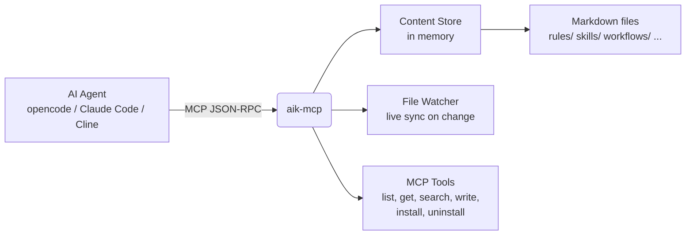

# MCP Tools

| Tool                 | Description                                                |
|----------------------|------------------------------------------------------------|
| `aik_list`           | List content items, optionally filtered by category or tag |
| `aik_get`            | Retrieve a specific item by path (e.g. `rules/typescript`) |
| `aik_search`         | Full-text fuzzy search across all content                  |
| `aik_write`          | Create or update a content item from the agent             |
| `aik_delete`         | Delete a content item                                      |
| `aik_install`        | Install an item into the project's agent config            |
| `aik_reinstall`      | Reinstall the latest version of an installed item          |
| `aik_uninstall`      | Remove an installed item from the project                  |
| `aik_uninstall_all`  | Remove all aik-installed items from the project            |
| `aik_list_installed` | List items currently installed in the project              |

## Resources

| URI                  | Description                                       |
|----------------------|---------------------------------------------------|
| `aik://{category}`   | List all items in a category (e.g. `aik://rules`) |
| `aik://search?q=...` | Search items by keyword                           |

## How it works

Your agent speaks MCP on one side. aik-mcp speaks your file system on the other. Everything is cached in memory for fast lookups, and a file watcher keeps the cache up to date.
